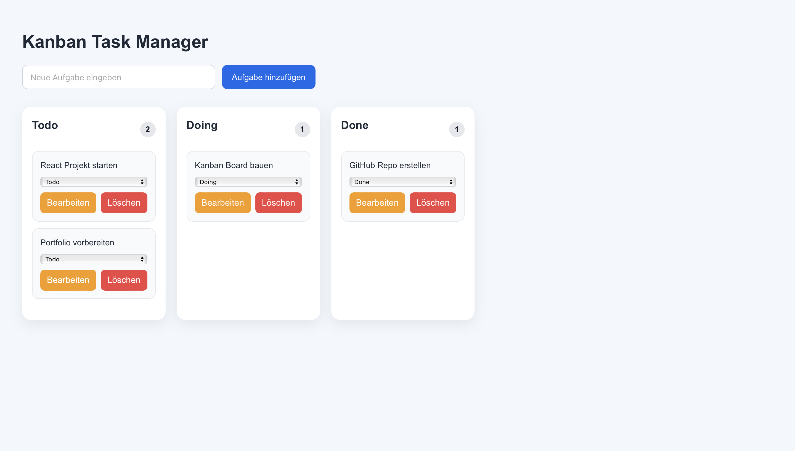

# Kanban Task Manager

A modern Kanban task management app built with React and TypeScript.

## Live Demo

[Open the live app](https://vercel.com/ufo401s-projects/kanban-task-manager)

## Screenshot



## Overview

This project is a simple Kanban-style task manager inspired by tools like Trello or Jira.  
Users can create, edit, delete, and move tasks between different workflow columns.

## Features

- Create new tasks
- Edit existing tasks
- Delete tasks
- Move tasks between Todo, Doing, and Done
- Drag and drop support
- Local storage persistence
- Responsive layout for smaller screens
- Task counter for each column

## Tech Stack

- React
- TypeScript
- Vite
- CSS
- Local Storage API

## Project Structure

```bash
src/
  App.tsx
  App.css
```

## Install dependencies

```bash
npm install
```

## Start development server
```bash
npm run dev
```

## Build for production
```bash
npm run build
```

## Learning Goals

This project was built to strengthen practical frontend development skills in:

- React component architecture
- TypeScript basics
- State management with React Hooks
- Form handling
- Drag and drop interactions
- Responsive UI design
- Persisting data using the Local Storage API

## Author

Ufuk Ibis  
GitHub: https://github.com/ufo401